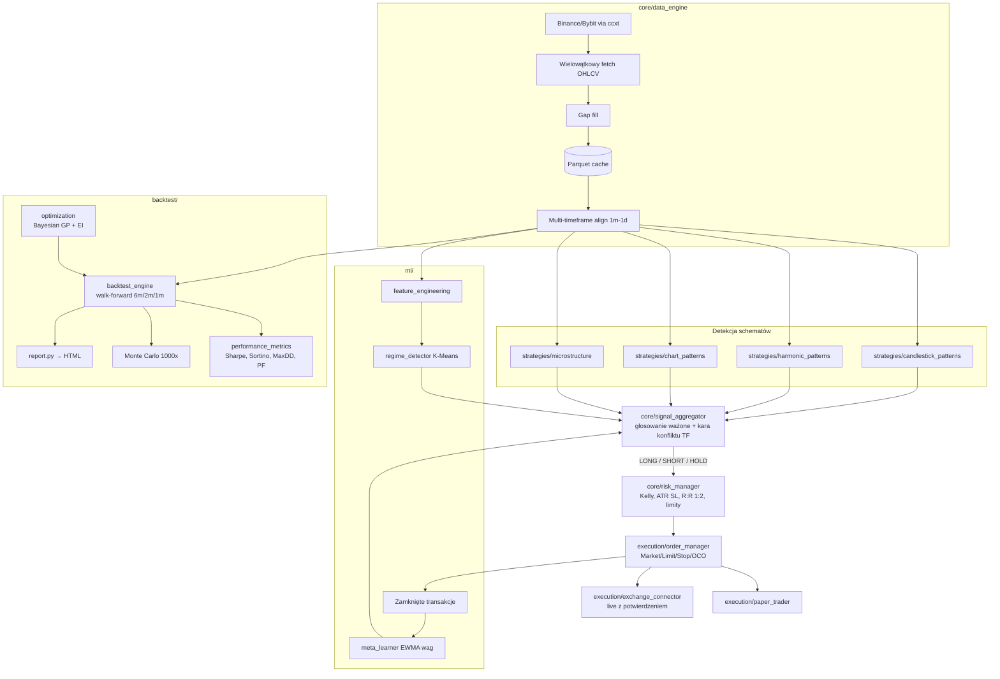

# Pattern Recognition Trading Bot

Modularny bot tradingowy w Pythonie oparty na rozpoznawaniu schematów
(formacje świecowe, harmoniczne, klasyczne, mikrostruktura) z silnikiem
konfluencji, zarządzaniem ryzykiem, backtestem walk-forward i klasyfikacją
reżimu rynku.

> **Ostrzeżenie:** projekt edukacyjny. Handel instrumentami finansowymi
> wiąże się z ryzykiem utraty kapitału. Domyślny tryb to **paper trading**
> — tryb live wymaga świadomej konfiguracji kluczy API i potwierdzania
> każdej transakcji.

## Architektura



## Szybki start

```bash
pip install -r trading_bot/requirements.txt

# Backtest walk-forward na danych syntetycznych (offline, bez API):
python -m trading_bot.main --mode backtest --synthetic

# Backtest na realnych danych Binance (publiczne API, bez kluczy):
python -m trading_bot.main --mode backtest --symbol BTC/USDT

# Paper trading (domyślny tryb):
python -m trading_bot.main --mode paper --synthetic

# XAUUSD (złoto, M15) — dedykowany preset (strategia sesyjna + koszty CFD):
python -m trading_bot.main --mode backtest --symbol XAU/USD \
    --config trading_bot/config/settings_xauusd.yaml

# Testy:
pytest trading_bot/tests --cov=trading_bot
```

Raport HTML z backtestu ląduje w `reports/` (equity curve, drawdowny,
heatmapa miesięczna, rozkład zwrotów, lista transakcji z logiką wejścia).

## Deployment (Docker)

```bash
docker build -f trading_bot/Dockerfile -t trading-bot .
docker run --rm \
  -e TRADINGBOT_MODE=paper \
  -e TRADINGBOT_EXCHANGES__BINANCE__API_KEY=... \
  -e TRADINGBOT_EXCHANGES__BINANCE__API_SECRET=... \
  -v $(pwd)/reports:/app/reports \
  trading-bot --mode backtest --symbol BTC/USDT
```

Klucze API podawaj **wyłącznie** przez zmienne środowiskowe
(`TRADINGBOT_...`, zagnieżdżenie przez `__`) — nigdy w plikach YAML.

## Zaimplementowane schematy

| Moduł | Formacje |
|---|---|
| `candlestick_patterns` | Bullish/Bearish Engulfing, Morning/Evening Star, Hammer, Hanging Man, Shooting Star, Three White Soldiers, Three Black Crows, Doji (standard/dragonfly/gravestone) |
| `harmonic_patterns` | Gartley (0.618 B / 0.786 D), Bat (0.382–0.500 / 0.886), Butterfly (0.786 / 1.272–1.618), Crab (0.382–0.618 / 1.618), AB=CD — tolerancja Fibo ±2%, walidacja proporcji czasowej fal, confidence z wolumenu i dywergencji RSI |
| `chart_patterns` | Head & Shoulders + inverse, trójkąty (symetryczny/rosnący/malejący), flaga/proporzec, prostokąt, Double Top/Bottom — sygnał dopiero po przebiciu poziomu aktywacji |
| `microstructure` | VWAP deviation (z-score), order flow imbalance (aproksymacja z OHLCV), liquidity void, S/R z walidacją min. 3 dotknięć |
| `xauusd_gold` | Strategia dedykowana XAUUSD: breakout rangu azjatyckiego (SL pod rangiem), londyński fakeout (stop-hunt reversal), odrzucenie poziomów psychologicznych co 25 USD, fade od sesyjnego VWAP; sygnały ważone płynnością sesji (nakładka LDN/NY 1.0× → Azja 0.5×); wolumen tick tylko jako bonus, nigdy wymóg |

## Silnik konfluencji

```
final = Σ(w_i · score_i) / Σ(w_i)
w_i   = waga_bazowa · mnożnik_reżimu (0.8–1.2×) · (0.5 + confidence)
```

potem kara za sprzeczne sygnały między timeframe'ami, a następnie progi:
`> 0.6 → LONG`, `< -0.6 → SHORT`, `[-0.2, 0.2] → HOLD`.

## Zarządzanie ryzykiem

- **Sizing:** pół-Kelly z twardym capem 5% kapitału,
- **SL:** 2×ATR14 lub poziom struktury formacji (wybierany ciaśniejszy),
- **TP:** minimum R:R 1:2, trailing stop po osiągnięciu +1R (start break-even),
- **Max Daily Loss 3%** — przekroczenie zatrzymuje handel do następnego dnia UTC,
- **Filtr korelacji:** max 3 pozycje o korelacji > 0.7,
- **Filtr zmienności:** brak wejść przy ATR > 150% średniej.

## Konfiguracja

Wszystkie parametry opisane inline w [`config/settings.yaml`](config/settings.yaml)
i [`config/exchanges.yaml`](config/exchanges.yaml). Każdą wartość można
nadpisać zmienną środowiskową: `TRADINGBOT_RISK__RR_MIN=3` →
`risk.rr_min = 3`.

## Backtest

- **Walk-forward:** okna 6m train / 2m test / 1m validation; model reżimu
  trenowany wyłącznie na oknie train (zero lookahead),
- **Koszty:** slippage 0.05% market / 0.02% limit, prowizje per giełda,
- **Monte Carlo:** 1000 permutacji kolejności transakcji (percentyle DD i kapitału),
- **Realizm:** wejście na open kolejnej świecy, intrabar SL/TP na high/low,
  przy trafieniu obu w jednej świecy konserwatywnie liczony stop loss.

## Struktura projektu

```
trading_bot/
├── config/          # settings.yaml, exchanges.yaml (pydantic-validated)
├── core/            # data_engine, pattern_detector, signal_aggregator,
│                    # risk_manager, indicators, models, config
├── strategies/      # base_strategy + 4 rodziny detektorów
├── execution/       # exchange_connector (ccxt/paper), order_manager, paper_trader
├── backtest/        # backtest_engine, performance_metrics, optimization, report
├── ml/              # feature_engineering, regime_detector, meta_learner
├── tests/           # pytest (deterministyczne fixtures formacji)
└── main.py          # CLI: --mode paper|live|backtest [--synthetic]
```

## Roadmap (nice-to-have)

- Dashboard Streamlit (sygnały, heatmapa strategii, wizualizacja reżimów),
- Alerty Telegram/Discord (sekcja `alerts` w configu jest już przygotowana),
- Auto-restart z persystencją stanu pozycji,
- WebSocket real-time data feed z REST fallback,
- On-chain data (Glassnode/Coinglass) jako dodatkowe features.
